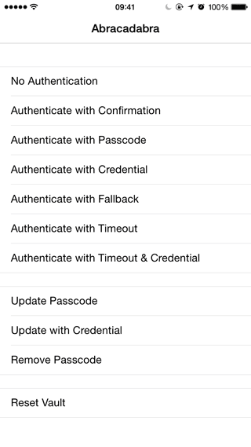

# Abracadabra

[](https://travis-ci.org/shaps80/Abracadabra)
[](http://cocoadocs.org/docsets/Abracadabra)
[](http://cocoadocs.org/docsets/Abracadabra)
[](http://cocoadocs.org/docsets/Abracadabra)

## Updates
_(Sunday 20th Feb 2015)_

* Events controller is not yet implemented -- in progress
* Settings controller is not yet implemented -- in progress
* When you provide a group/name this entry will be persisted across launches and the policy is a default only. So if you change the policy across runs or allow runtime configuration, then the value might not be what you see in code. This feature is not yet working correctly -- in progress
* <del>TouchID is not yet implemented</del> -- __DONE__
* Abracadabra currently launches in the current orientation but doesn't support orientation changes while its being presented yet -- in progress

## What is it?

Abracadabra was designed for a personal project of mine. An app called [Drizzle](https://itunes.apple.com/app/drizzle/id683629145?mt=8).  Drizzle is an application for managing server instances on [Digital Ocean](http://digitalocean.com). As you can imagine this is the kind of app that requires tight control over user actions to avoid accidental shutdowns or worse. Not to mention foul play by a 3rd party.

This was an existing project, so I didn't want to modify lots of existing code possibly introducing further issues and less stability. 

So I set out to design a truly plug 'n' play solution that made it super easy to wrap my code and gain all the benefits of passcode security.

This is not just a PIN entry User Interface. In fact that part of the library is completely optional and for your convenience. Abracadabra handles all of your security needs.

* Easily secure your code using a single convenience macro (with multiple options)
* Easily find all the Abracadabra references in your code and show them at runtime for user configuration
* Layout support for both iPhone and iPad, including rotation

Plus if you're including the entire library in your project, you even get the optional UI elements. In fact you don't even have to write any code to get started. Just include the POD and it will be used by default ;)

<p style="text-align: center"></p>

__Introducing Abracadabra!__

>The name refers to the magical nature of its implementation as well as the fact a passcode (_or magical phrase_) is required ;)

## Usage

To run the example project, clone the repo, and run `pod install` from the Example directory first.

To use Abracadabra in your own projects, add `#import "Abracadabra.h"` to your file & simply wrap your code with a secure block.

Lets say you have some code like this:

```objc
NSURLSession *session = [NSURLSession sharedSession];
NSURL *URL = [NSURL URLWithString:@"http://api.server.com/server?id=23213&action=restart"];
NSURLRequest *request = [NSURLRequest requestWithURL:URL];
NSURLSessionDataTask *task = [session dataTaskWithRequest:request];
[task resume];
```

We can easily secure that code now by wrapping it with Abracadabra. Magic!

```objc
Abracadabra(SPXSecurePolicyAlwaysWithPIN, {
  NSURLSession *session = [NSURLSession sharedSession];
  NSURL *URL = [NSURL URLWithString:@"http://api.server.com/server?id=23213&action=restart"];
  NSURLRequest *request = [NSURLRequest requestWithURL:URL];
  NSURLSessionDataTask *task = [session dataTaskWithRequest:request];
  [task resume];
})
```

If you're happy with the default view controllers and behaviour, __that's literally it ;)__
You don't even have to configure options, provide views, nothing! Just sit back, relax and let the magic happen. 

Its recommended that you always provide a group and name even if you don't plan to implement the viewController in-app because this is also used for providing better textual feedback for confirmation dialogs, etc...

>You may also notice semi-colons and curly-braces are entirely optional with single line entries _(in both success and failure blocks)_. Abracadabra takes care of this for you, keeping your code clutter-free ;)

_You're welcome ;)_

## Runtime Configuration

Sometimes however, you want to provide a nice little UI to your users to allow them to control the security policy applied to individual actions right?

Well that's easy too, just add a group and event name to your secure code blocks and Abracadabra will handle the rest for you!

```objc
Abracadabra(@"Servers", @"Restart Server", SPXSecurePolicyAlwaysWithPIN, {
  NSURLSession *session = [NSURLSession sharedSession];
  NSURL *URL = [NSURL URLWithString:@"http://api.server.com/server?id=23213&action=restart"];
  NSURLRequest *request = [NSURLRequest requestWithURL:URL];
  NSURLSessionDataTask *task = [session dataTaskWithRequest:request];
  [task resume];
})
```

In fact any of the variations below are valid statements:

```objc
  Abracadabra(SPXSecurePolicyNone, {
     /* this code will execute if access is allowed */
  });
  
  Abracadabra(@"", @"", SPXSecurePolicyNone, {
     /* this code will execute if access is allowed */
  });
  
  Abracadabra(SPXSecurityPolicyNone, {
	  /* this code will execute if access is allowed */
  }, { \
	  /* this code will execute if access is disallowed */ \
  });
  
  Abracadabra(@"", @"", SPXSecurePolicyNone, {
     /* this code will execute if access is allowed */ \
  }, { \
	  /* this code will execute if access is disallowed */ \
  });
```

Notice those second blocks? This allows you to control flow based on success or failure. In this case, `-performSecureCode` will be executed only if the policy is authenticated. Otherwise the return statement will be executed and the log statement will never be shown.

```objc
  Abracadabra(SPXSecurePolicyAlwaysWithPIN, {
	  [self performSecureCode]; \
  }, return)
  
  NSLog(@"Authentication Failed.");
```

By using optional parenthese around the return, we can now move the log statement inside the failure block too.

```objc
  Abracadabra(SPXSecurePolicyAlwaysWithPIN, {
	  [self performSecureCode]; \
  }, {
      NSLog(@"Authentication Failed.");
      return; // in this case no more code exists at this scope, so this is no longer required
  })
```

## Advanced Configurations

Abracadabra has been designed to be quite flexible and takes care of all the security for you. 

Out of the box the following areas can be customized:

* Passcode input view controller (_who says you need 4 digits?_)
* Event security policies view controller
* Passcode validation 
* Session policies (_timeout, retries, etc..._)
* more...

See the example project for full demo's on how to use all of these features.

## Under the Hood

Under the hood, the library is responsible for saving your passcode to the keychain, comparing entries, tracking retries, presenting passcode entry, and much, much more...

One of the key features however, exists in how Abracadabra can discover all of the secure events in your code and present a nice view of this, allowing the user to modify the policy applied to each event at runtime. In fact, Abracadabra even persists this information automatically across launches ;)

__So how does this work?__

This part of the code is actually based on an idea I got from [FBTweaks](https://github.com/facebook/Tweaks). Facebook demonstrated a great implementation whereby you can store some data in the binary at compile time.

Abracadabra uses the Mach-O Runtime to find this data and automatically construct a store of events. The view controllers can then simply query this store to present some user interface for configuring their policies. 

Policies for each event are then stored in `NSUserDefaults`, which allows us to persist changes across launches of the application.

When you create a secure event, you must specify the default policy to apply to that piece of code. You can also reset an event (or all events) back to their defaults at any time, since this value is stored at compile time and is readonly at runtime.

>All views and controllers can be replaced with your own implementations if you prefer.

>Internally, Abracadabra is asynchronous so that we don't block the main thread, however all code you wrap is guaranteed to execute on the calling thread. So your expectations won't change. However since its asynchronous, you will need to be careful with execution order. Its recommended that you wrap everything in the current scope.

## Why should I use Abracadabra?

Many applications or even 3rd party libraries exists with some form of Passcode based integration. However most of these are using baked-in -- and often incomplete -- implementations.

Providing a passcode in your application isn't just about showing PIN entry form inside your view. This just gives your users a false sense of security around their actions and/or data. 

Also, many open source implementations rely on the implementer to perform unneccary checks, this includes Apples high level solution regarding TouchID.

Abracadabra was designed to remove almost all 'security' code from your project. This allows you to focus on your features and build application logic, leaving security as an after thought. 

>Note I'm not advocating the idea of __NOT__ considering security! However if you're not going to, at least use Abracadabra to make your life easier and your code more secure. 

The design choices I've made exist to make it easier for you to implement in your code, increasing the chance that you'll spend time securing your applications.

One of the best reasons to use Abracadabra, is because my solution is so elegant and lightweight, making it really, really simple to improve the security library itself, without having to update your app code at all!

## Installation

Abracadabra is available through [CocoaPods](http://cocoapods.org). To install
it, simply add the following line to your Podfile:

To include all components:
    `pod 'Abracadabra'`
    
To include only the core
	`pod 'Abracadabra/Core'`

## Author

Shaps Mohsenin, [@shaps](http://twitter.com/shaps)

## License

Abracadabra is available under the MIT license. See the LICENSE file for more info.

